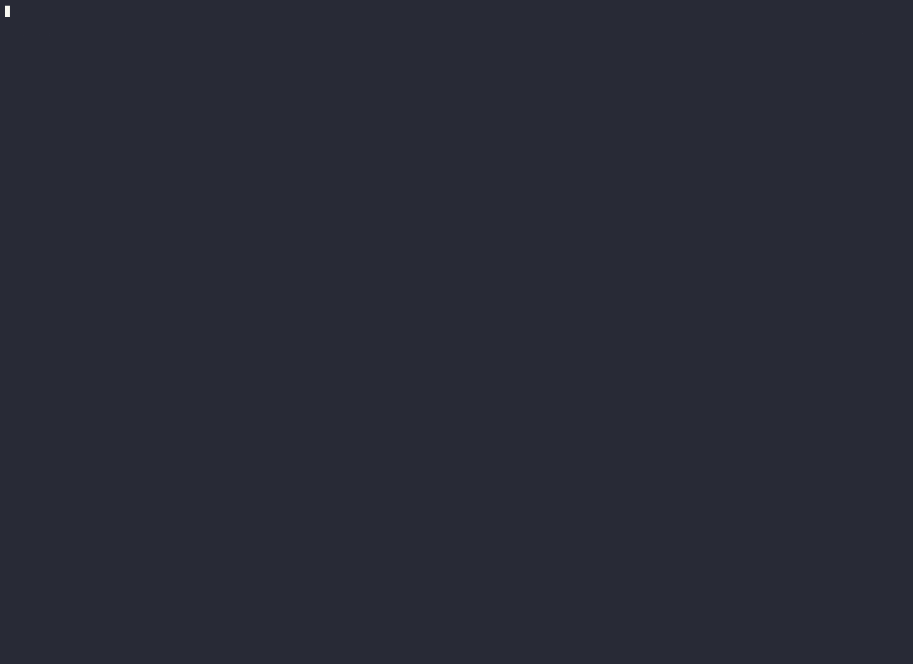

# Demo: Chi tiêu kép (Double Spending)

## Terminal recording

## Interactive visualization

[Xem interactive demo →](https://raw.githack.com/9bany/ptit_apex/master/docs/interactive.html)

Gồm hai tab:
- **Chi tiêu kép** — switch giữa không mutex / có mutex
- **Deadlock** — minh họa vòng tròn chờ khi lock sai thứ tự
